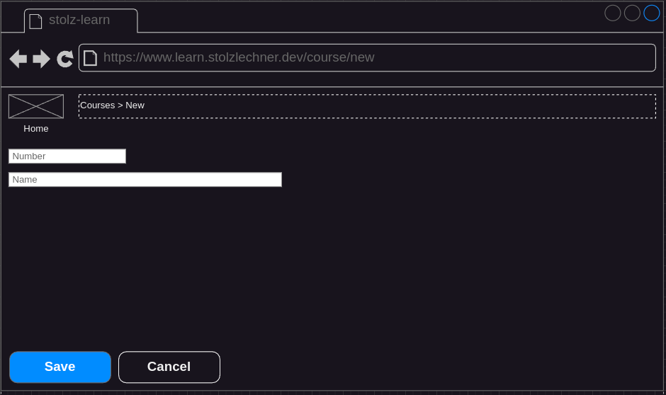
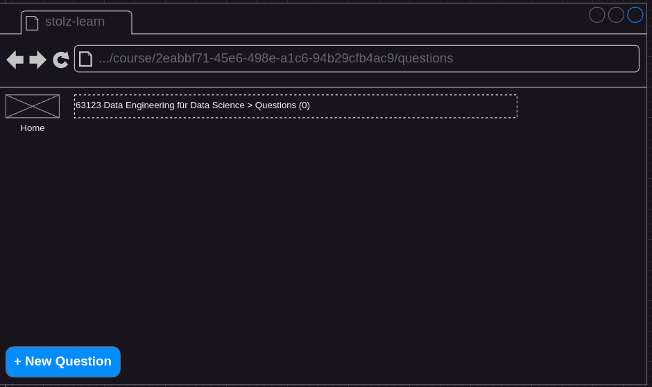

## Status
- specified
- not implemented

## Precondition
- The user is on the home screen (see [Navigate To Home](./navigate-to-home/navigate-to-home.md))

## Description
- The user clicks on the button `New Course`.
- The user sets a number and a name for the new course.

- He can submit the creation by clicking on the save button.
    - The submit button is only enabled when at least one character is in each text field.
    - When the user clicks on cancel, the creation is aborted (route back to home).
    - When the user sets a number which is already existing in the database, an error message `The given number is already set for another course` is shown, and the number field is set to an empty string.
- He is routed to the question catalog of the newly created course.

