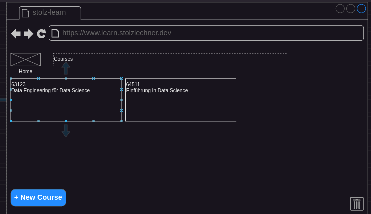
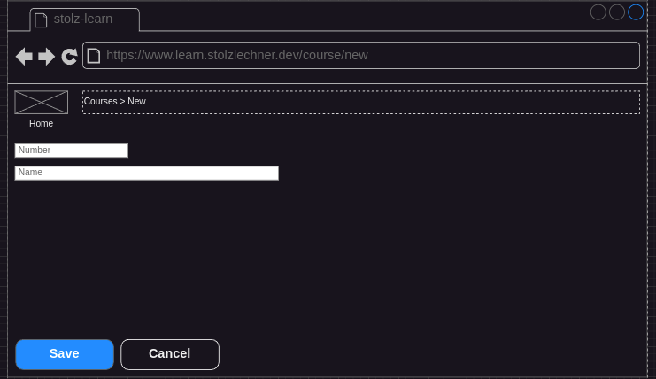
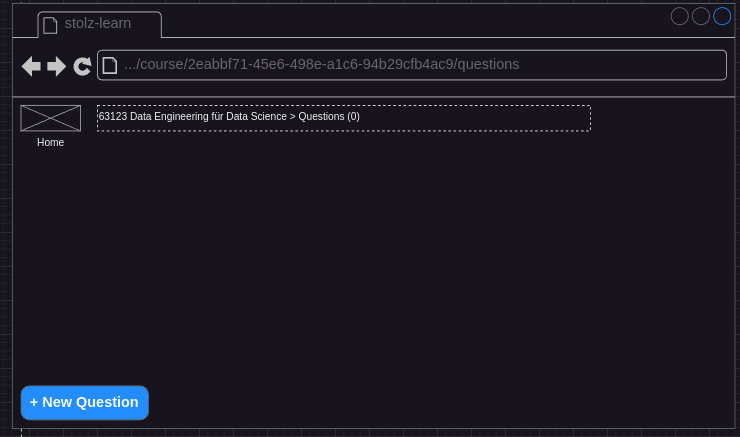

## Status
- specified
- not implemented

## Description
- The user is on the home screen ([Navigate To Home](../navigate-to-home/navigate-to-home.md))
- The user clicks on the button `New Course`
- The user sets a number and a name for the new Course
- He submits the creation by clicking on the save button
    - The submit Button is only enabled when at least one character is in each text-field
    - When the user is clicking on cancel, the creation is aborted
    - When the user sets a number which is already existing in the database an error message is shown and the number field is set to an empty string
- He is routet to the question catalog of the newly created course

## Screenshots / Mocks

