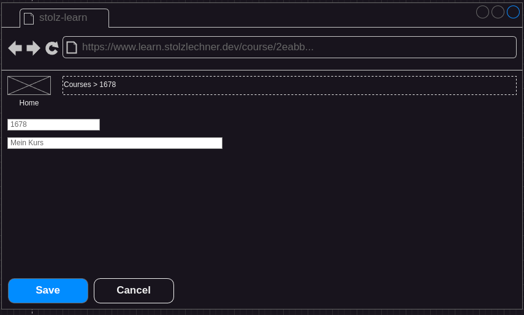

## Status
- specified
- not implemented

## Precondition
- a course is selected (see [Select Course](./select-course/course-select.md))

## Description
- The user clicks on Edit
- The app routes to a new screen

- The save button is disabled as long as no value has been changed.
- The user changes the number or the name
    - if one of the fields is empty the save button is disabled
- The user clicks on save, the app routes back to the selected course with the new given values
- The user clicks on cancel, the app routes back to the selected course with the old values