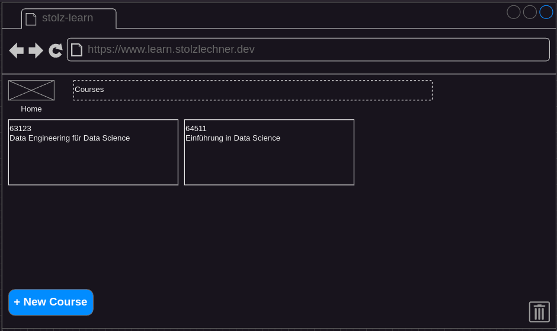

## Status
- specified
- not implemented

## Precondition
- The user is on the home screen ([Navigate To Home](./navigate-to-home/navigate-to-home.md))

## Description
- The user clicks on the trash button in the bottom right corner
- The app routes to a view where the archived courses ar shown

- the archived courses are shown in a table 
    - if no courses are archived an info text informs the user about that
- there is a button to restore the course on the right side of each row
- a click on this button restores the course and bring it back to the main overview
- The Back button brings the user back to the course overview