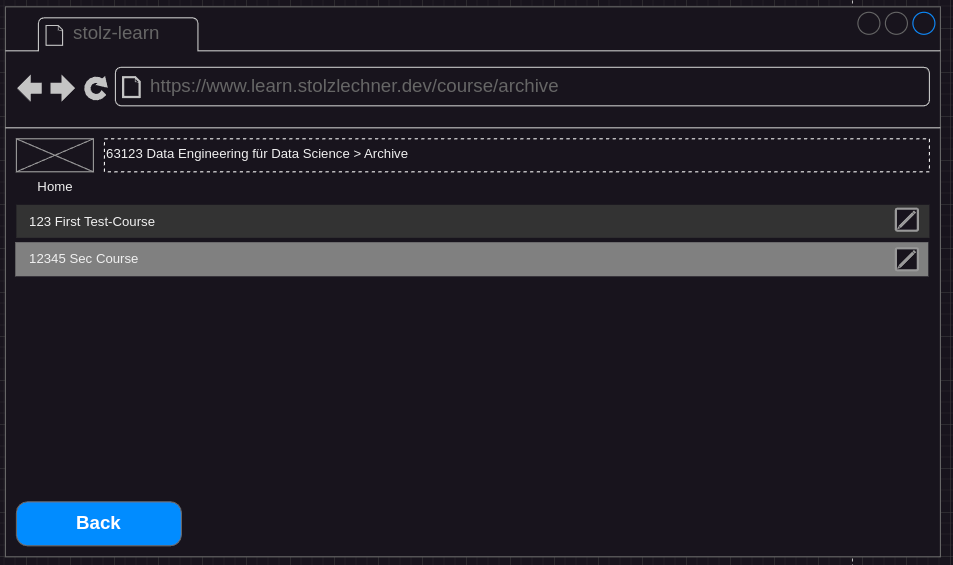

## Status
- specified
- not implemented

## Precondition
- The user is on the home screen (see [Navigate To Home](./navigate-to-home/navigate-to-home.md))

## Description
- The user clicks on the trash button in the bottom right corner.
- The app routes to a view where the archived courses are shown.

- The archived courses are displayed in a table:
    - If no courses are archived, an info text informs the user about that.
- There is a button to restore the course on the right side of each row.
- A click on this button restores the course and brings it back to the main overview.
- The Back button brings the user back to the course overview.
