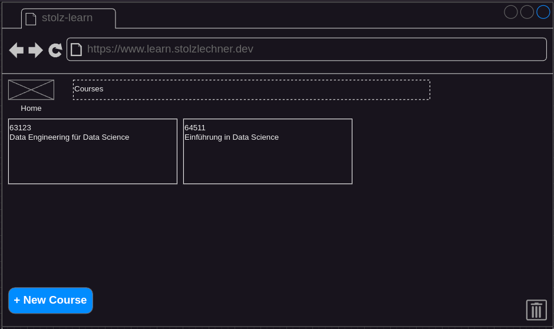

## Status
- specified
- not implemented

## Precondition
- The user is on the home screen (see [Navigate To Home](./navigate-to-home/navigate-to-home.md))
- At least one course is created (see [Create a Course](./course-create/course-create.md))

## Description
- Each course is displayed as a card.
- A hover over a card shows a cursor pointer.
- A click on the card navigates to the course overview, where the course statistics and some operations are shown.

