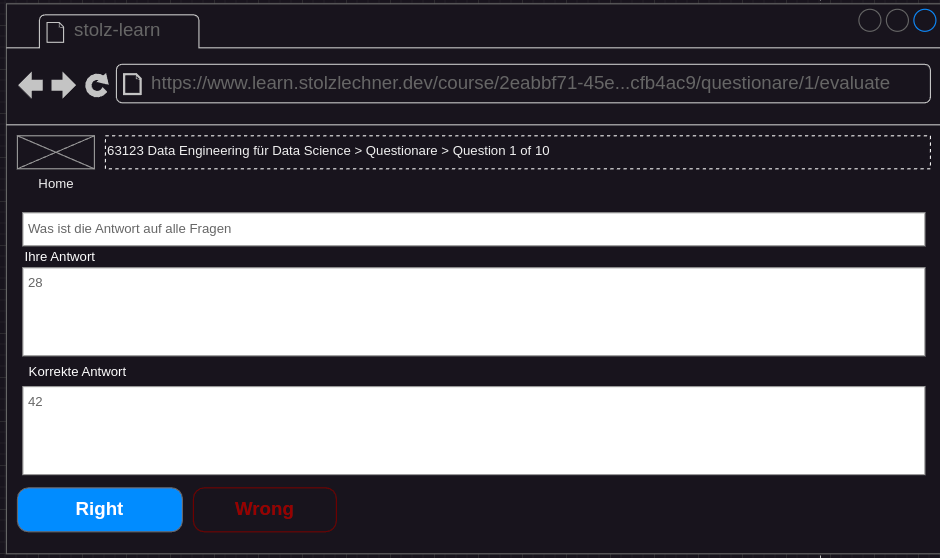

## Status
- specified
- not implemented

## Precondition
- A questionnaire is started (see [Create Questionnaire](./questionare-create.md))

## Description
- The question is displayed.

- The user types in the answer and clicks on "submit".
- The typed-in answer and the correct answer are shown.

- The user can click on "Wrong" or "Right", depending on whether they think they gave the correct answer.
- A new question is displayed or the questionnaire statistic appears (if this is the last question).
