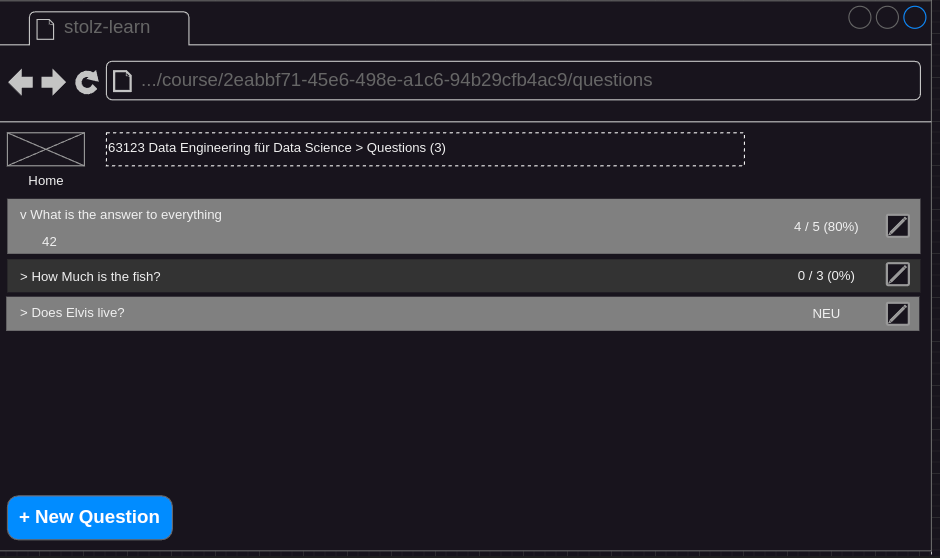
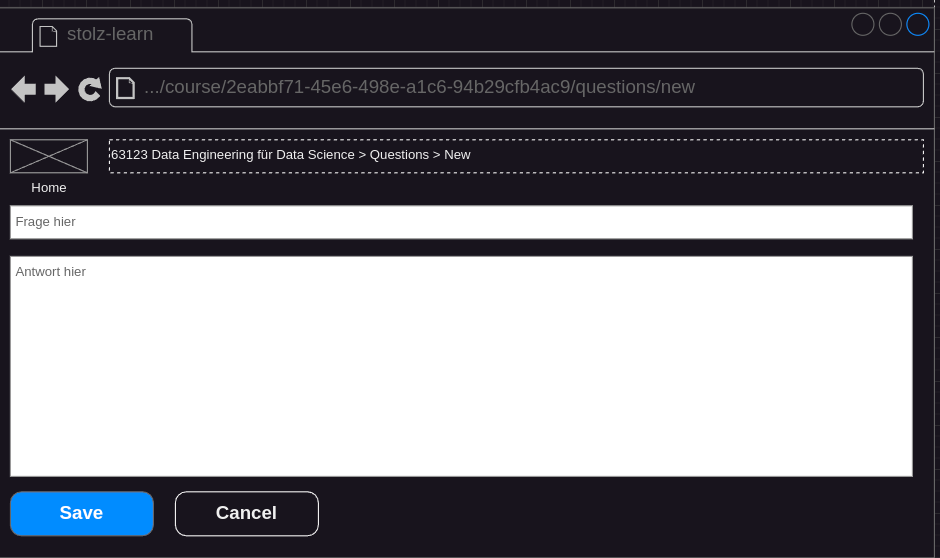

## Status
- specified
- not implemented

## Precondition
- A course is selected ([Select Course](./course-select.md))

## Description
- The user clicks on the "Questions" button. The "List Questions" screen appears.

- The user clicks on the "New Question" button. A form appears.

- The user types in the question and the answer. The save button becomes enabled when each field has a value.
- The user clicks on "save". The app shows the full question list again (with the newly created question).
- A click on "cancel" does not create the question.
