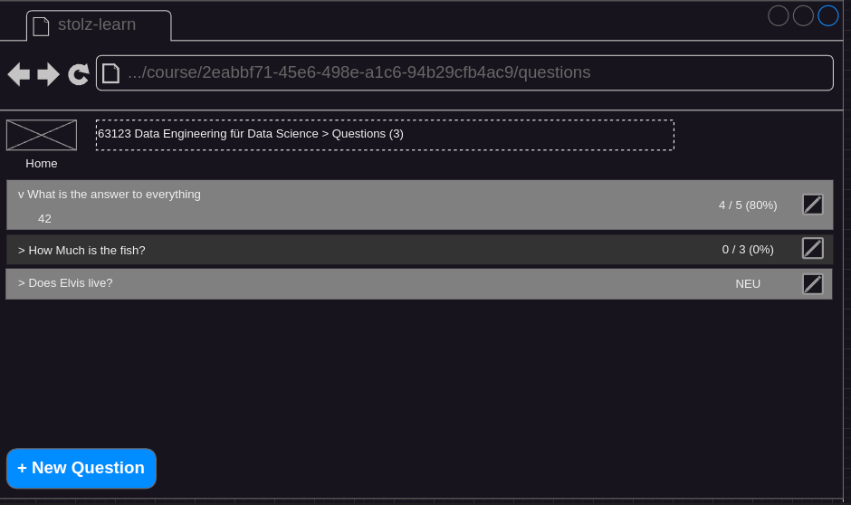
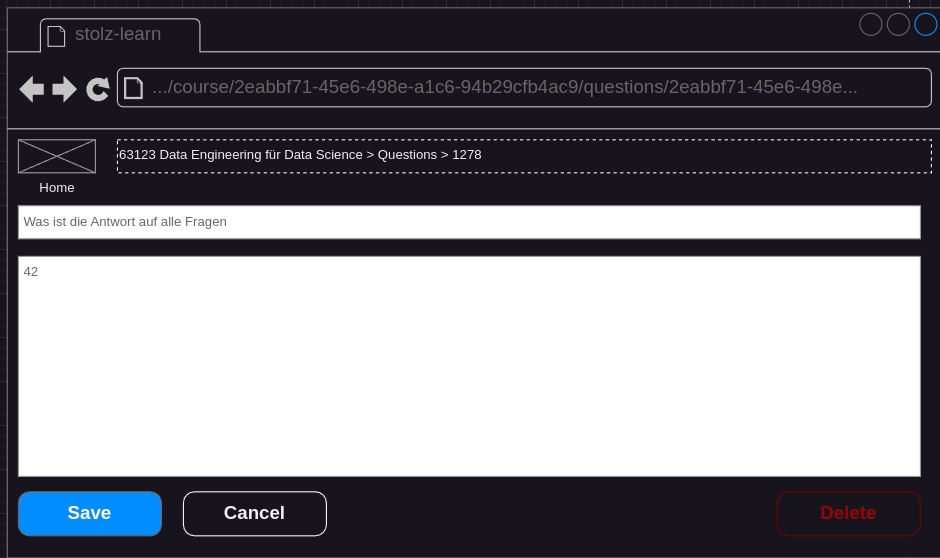

## Status
- specified
- not implemented

## Precondition
- A course is selected ([Select Course](./course-select.md))

## Description
- The user clicks on the "Questions" button. The "List Questions" screen appears.

- The user clicks on the edit button of a question (right side).
- The "Edit Question" dialog appears.

- The user changes the question or the answer. The save button gets enabled when at least one field has changed.
- The user clicks on "delete". A confirm dialog is shown: `Do you really want to delete the question? Yes/No`.
- A click on "Yes" deletes the question. The full question list is shown again.
- A click on "No" does not delete the question. The "Edit Question" screen is shown.
