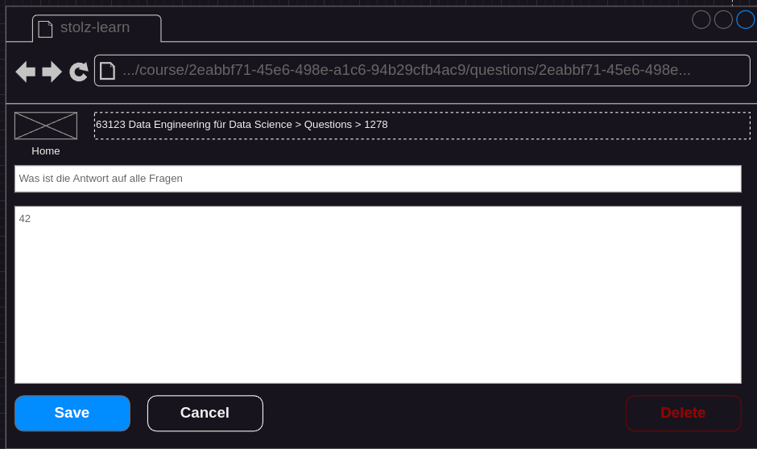

## Status
- specified
- not implemented

## Precondition
- a course is selected ([Select Course](./course-select.md))

## Description
- The user clicks on the Questions Button. The List Question Screen appears

- The user clicks on the edit button of the question (right side)
- The edit question dialog appears

- The user changes the question or the answer. The save button gets enabled when at least one field has changed.
- The user clicks on save. The full question list is shown with the updated question.
- A click on cancel also shows the full question  list but with no update