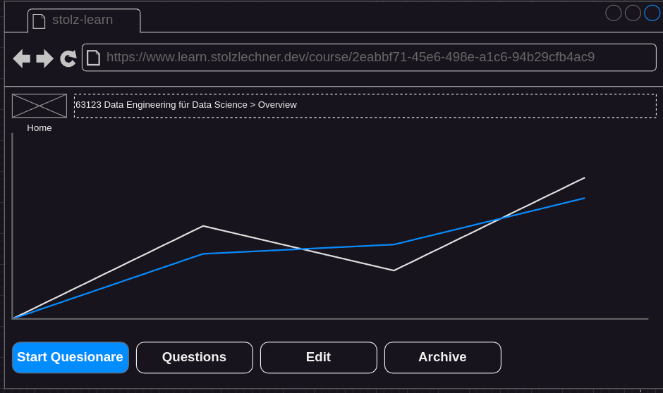
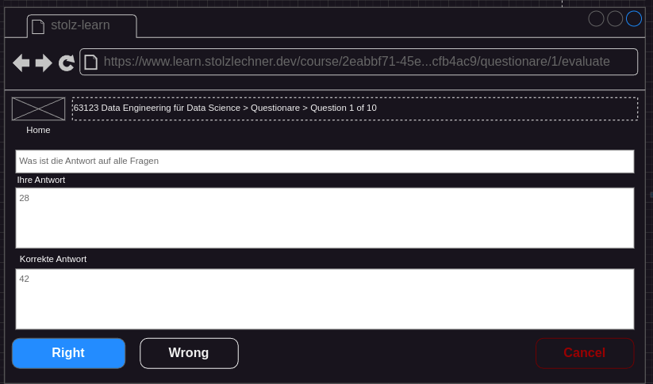

## Status
- specified
- not implemented

## Precondition
- a course is selected ([Select Course](./course-select.md))

## Description
- The user clicks on the start questionare button.
- The user answers 10 questions ([Answer Question](./question-answer.md))

- At least a statistic is shown (how many answers are right how many are wrong)

- A click on ok goes back to the selected course

## Cancel
- The user can cancel a questionare. When he click on cancel during the Answer Steps or clicking to the home button.
- In this case a confirm dialog is shown `Do you really want to cancel the quesitonare (no answer is saved) Yes/No`
- A click on No simply closes the confirm dialog a click on Yes goes back to the selected course.