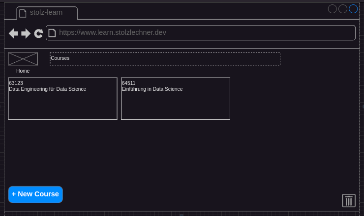
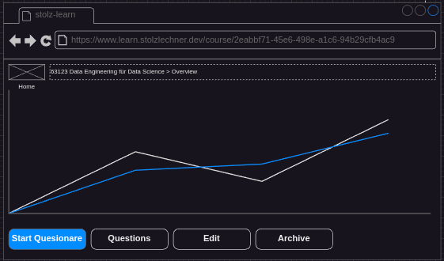

## Status
- specified
- not implemented

## Precondition
- user is on the home screen (see [Navigate To Home](../navigate-to-home/navigate-to-home.md))
- at least one course is created (see [Create a Course](../course-create/course-create.md))

## Description
- each course is displayed as a card
- a hover over a card shows a cursor-pointer
- a click on the card navigates to the course overview, where the course statistics and some operations are shown

## Screenshots / Mocks

